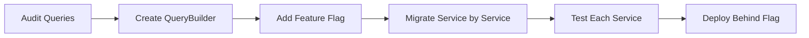
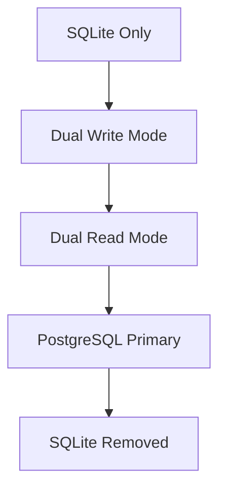

# Iteration Implementation Guide

## Overview

This guide outlines how to implement the improvement plan in iterative sprints while maintaining project integrity, ensuring zero downtime, and preserving system consistency throughout the process.

## Core Principles

1. **Feature Flags**: Every major change behind a feature flag
2. **Backward Compatibility**: New code must work with existing data/systems
3. **Incremental Rollout**: Test in dev → staging → production (gradual)
4. **Data Integrity**: Never lose or corrupt data during migrations
5. **Rollback Ready**: Every change must be reversible
6. **Continuous Testing**: Automated tests before, during, and after changes

## Sprint Structure (2-Week Sprints)

### Sprint 1: Security Foundation
**Goal**: Fix critical vulnerabilities without breaking existing functionality

#### Week 1: SQL Injection & Auth Security


**Implementation Steps**:

1. **Day 1-2: SQL Injection Prevention**
   ```typescript
   // Step 1: Create QueryBuilder with feature flag
   export class QueryBuilder {
     static isEnabled = process.env.USE_QUERY_BUILDER === 'true';
     
     static query<T>(sql: string, params?: any[]): Promise<T[]> {
       if (this.isEnabled) {
         return this.secureQuery(sql, params);
       }
       return legacyQuery(sql, params); // Existing implementation
     }
   }
   ```

   ```bash
   # Deployment sequence
   1. Deploy code with feature flag OFF
   2. Test in staging with flag ON
   3. Enable for 10% of production traffic
   4. Monitor for 24 hours
   5. Gradually increase to 100%
   ```

2. **Day 3-4: Rate Limiting (Non-Breaking)**
   ```typescript
   // Implement as middleware that can be toggled
   export const rateLimitMiddleware = (req, res, next) => {
     if (!config.rateLimiting.enabled) {
       return next(); // Skip if disabled
     }
     // Rate limiting logic
   };
   ```

3. **Day 5: Integration Testing**
   - Run full test suite with new security features
   - Performance benchmarks
   - Security scanning

#### Week 2: Memory Fixes & Basic Tests
1. **Day 1-2: Memory Leak Fixes**
   ```typescript
   // Gradual migration approach
   class AudioService {
     async processAudio(file: string) {
       if (config.useNewStreamHandling) {
         return this.processWithStreamManagement(file);
       }
       return this.legacyProcess(file); // Keep old code
     }
   }
   ```

2. **Day 3-5: Essential Auth Tests**
   - Write tests for both old and new implementations
   - Ensure tests pass with feature flags on/off

### Sprint 2: Database Migration Preparation
**Goal**: Prepare for PostgreSQL without disrupting SQLite

#### Week 1: Dual Database Support
```typescript
// Database abstraction layer
interface DatabaseAdapter {
  query<T>(sql: string, params: any[]): Promise<T[]>;
  transaction<T>(fn: (client: any) => Promise<T>): Promise<T>;
}

class DatabaseFactory {
  static create(): DatabaseAdapter {
    switch (process.env.DB_TYPE) {
      case 'postgres':
        return new PostgreSQLAdapter();
      case 'sqlite':
      default:
        return new SQLiteAdapter();
    }
  }
}
```

**Migration Strategy**:


1. **Dual Write Mode**: Write to both databases
2. **Verification**: Compare data consistency
3. **Dual Read**: Read from PostgreSQL, fallback to SQLite
4. **Cutover**: PostgreSQL becomes primary
5. **Cleanup**: Remove SQLite code

#### Week 2: Data Migration Scripts
```bash
# Incremental migration approach
1. Migrate user data (low volume)
2. Verify integrity
3. Migrate conversations (medium volume)
4. Verify integrity
5. Migrate audio metadata (high volume)
6. Final verification
```

### Sprint 3: Performance Infrastructure
**Goal**: Add caching and optimization without breaking changes

#### Week 1: Caching Layer
```typescript
// Transparent caching with fallback
class CachedUserService extends UserService {
  async getUser(id: string): Promise<User> {
    try {
      // Try cache first
      const cached = await cache.get(`user:${id}`);
      if (cached) return cached;
    } catch (error) {
      // Log but don't fail
      logger.warn('Cache error, falling back to DB', error);
    }
    
    // Fallback to database
    const user = await super.getUser(id);
    
    // Try to cache (non-blocking)
    cache.set(`user:${id}`, user).catch(() => {});
    
    return user;
  }
}
```

#### Week 2: Query Optimization
- Implement DataLoader pattern alongside existing queries
- Add indexes without locking tables
- Monitor query performance

### Sprint 4: Testing Infrastructure
**Goal**: Build comprehensive tests without breaking CI/CD

#### Parallel Test Development
```json
{
  "scripts": {
    "test": "npm run test:existing",
    "test:existing": "jest --testMatch='**/*.spec.js'",
    "test:new": "jest --testMatch='**/*.test.ts'",
    "test:all": "npm run test:existing && npm run test:new"
  }
}
```

### Sprint 5: Monitoring & Observability
**Goal**: Add monitoring without performance impact

```typescript
// Opt-in monitoring
class MonitoredService {
  @MetricsDecorator({ enabled: config.metrics.enabled })
  async processRequest() {
    // Only tracks metrics if enabled
  }
}
```

## Iteration Checkpoints

### Before Each Sprint
- [ ] All tests passing on main branch
- [ ] Production metrics baseline captured
- [ ] Rollback plan documented
- [ ] Feature flags configured
- [ ] Staging environment matches production

### During Each Sprint
- [ ] Daily smoke tests
- [ ] Monitor error rates
- [ ] Track performance metrics
- [ ] Review security scans
- [ ] Update documentation

### After Each Sprint
- [ ] Full regression testing
- [ ] Performance comparison
- [ ] Security audit
- [ ] Team retrospective
- [ ] Update runbooks

## Risk Mitigation Strategies

### 1. Database Migration Risks
```typescript
// Implement circuit breaker for database operations
class DatabaseCircuitBreaker {
  private failures = 0;
  private lastFailure: Date;
  private readonly threshold = 5;
  private readonly timeout = 60000; // 1 minute
  
  async execute<T>(operation: () => Promise<T>): Promise<T> {
    if (this.isOpen()) {
      throw new Error('Circuit breaker is open');
    }
    
    try {
      const result = await operation();
      this.onSuccess();
      return result;
    } catch (error) {
      this.onFailure();
      throw error;
    }
  }
}
```

### 2. Performance Degradation
```typescript
// Automatic performance monitoring
class PerformanceGuard {
  private readonly thresholds = {
    responseTime: 1000, // 1 second
    errorRate: 0.05,    // 5%
    cpuUsage: 0.8       // 80%
  };
  
  async checkHealth(): Promise<HealthStatus> {
    const metrics = await this.collectMetrics();
    
    if (metrics.responseTime > this.thresholds.responseTime) {
      await this.triggerScaleUp();
    }
    
    if (metrics.errorRate > this.thresholds.errorRate) {
      await this.enableCircuitBreaker();
    }
    
    return metrics;
  }
}
```

### 3. Security Vulnerabilities
```yaml
# Automated security checks in CI/CD
security-scan:
  stage: test
  script:
    - npm audit
    - trivy fs .
    - semgrep --config=auto
  only:
    changes:
      - "**/*.ts"
      - "**/*.js"
      - "**/package.json"
```

## Communication Plan

### Stakeholder Updates
```markdown
## Sprint X Update - [Date]

### Completed This Sprint
- ✅ [Feature 1] - [Impact]
- ✅ [Feature 2] - [Impact]

### Metrics
- Response Time: X ms (↓ Y%)
- Error Rate: X% (↓ Y%)
- Test Coverage: X% (↑ Y%)

### Next Sprint
- 🎯 [Planned Feature 1]
- 🎯 [Planned Feature 2]

### Risks & Mitigations
- ⚠️ [Risk]: [Mitigation Plan]
```

### Team Coordination
- Daily standups during active changes
- Pair programming for critical changes
- Code reviews mandatory for all changes
- Runbook updates after each deployment

## Rollback Procedures

### Feature Flag Rollback (Immediate)
```bash
# 1. Disable feature flag
curl -X POST https://api.vibecheck.com/admin/flags \
  -H "Authorization: Bearer $ADMIN_TOKEN" \
  -d '{"flag": "new_feature", "enabled": false}'

# 2. Verify rollback
curl https://api.vibecheck.com/health/features
```

### Database Rollback (Within 24 hours)
```sql
-- 1. Stop writes to new database
UPDATE system_config SET postgres_writes_enabled = false;

-- 2. Replay missed writes from SQLite
INSERT INTO postgres.conversations 
SELECT * FROM sqlite.conversations 
WHERE updated_at > '2024-01-20 00:00:00';

-- 3. Switch reads back to SQLite
UPDATE system_config SET primary_db = 'sqlite';
```

### Code Rollback (Anytime)
```bash
# 1. Identify last stable release
git tag -l --sort=-version:refname | head -5

# 2. Create rollback branch
git checkout -b rollback/sprint-X v1.2.3

# 3. Deploy rollback
./scripts/deploy-production.sh --branch rollback/sprint-X
```

## Success Criteria Per Sprint

### Sprint 1 (Security)
- [ ] 0 SQL injection vulnerabilities
- [ ] Auth rate limiting active
- [ ] Memory usage stable over 24 hours
- [ ] 50% auth test coverage

### Sprint 2 (Database)
- [ ] Dual database mode working
- [ ] Data consistency 100%
- [ ] Migration scripts tested
- [ ] Rollback tested

### Sprint 3 (Performance)
- [ ] Cache hit rate > 60%
- [ ] Query time reduced by 40%
- [ ] No N+1 queries
- [ ] DataLoader implemented

### Sprint 4 (Testing)
- [ ] 80% backend coverage
- [ ] 70% frontend coverage
- [ ] E2E tests passing
- [ ] CI time < 10 minutes

### Sprint 5 (Monitoring)
- [ ] All services monitored
- [ ] Alerts configured
- [ ] Dashboards created
- [ ] Runbooks updated

## Long-term Maintenance

### Technical Debt Tracking
```typescript
// Mark code for future cleanup
/**
 * @deprecated Use QueryBuilder instead
 * @removeBy 2024-06-01
 * @migrationGuide docs/query-migration.md
 */
function legacyQuery(sql: string): Promise<any> {
  // Old implementation
}
```

### Continuous Improvement
- Weekly code quality reviews
- Monthly security audits
- Quarterly performance reviews
- Annual architecture review

## Conclusion

This iterative approach ensures:
1. **No Big Bang**: Changes are incremental and reversible
2. **Continuous Delivery**: Value delivered every sprint
3. **Risk Management**: Issues caught early and contained
4. **Team Learning**: Skills built progressively
5. **Business Continuity**: Zero downtime throughout

Follow this guide and adapt based on your team's capacity and business needs. The key is maintaining flexibility while ensuring systematic progress.