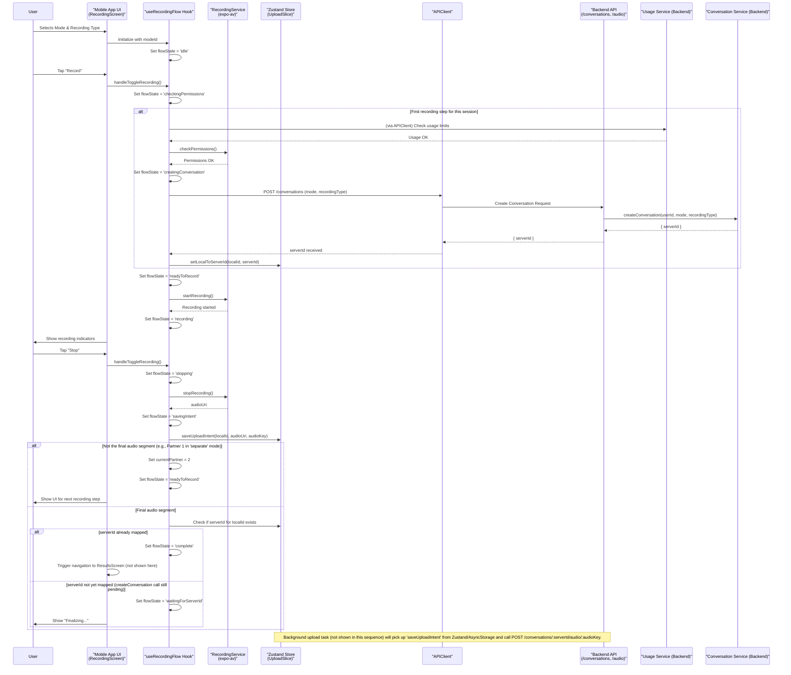
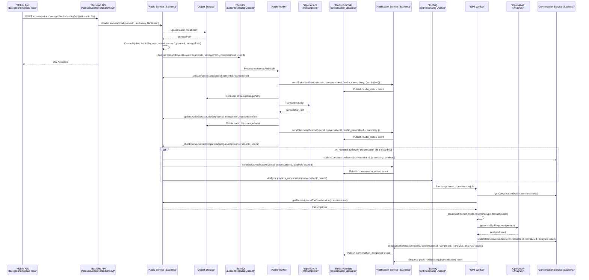
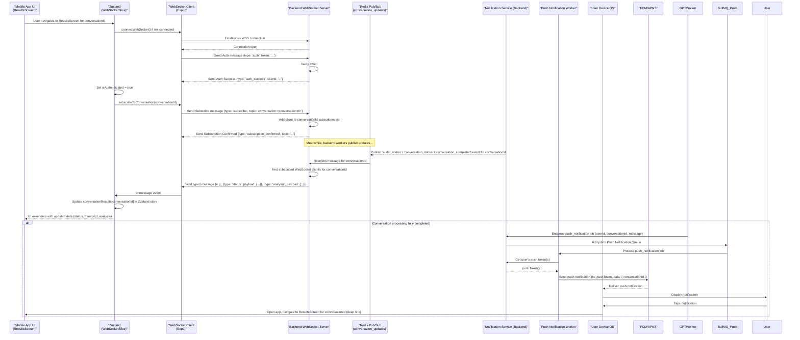

# VibeCheck Architecture Analysis Report

This document is the living architecture analysis report for the VibeCheck project. It contains all completed diagrams, system mapping, findings, and recommendations as the analysis progresses.

---

## 1. System Architecture Diagrams

### Overall System Architecture Diagram
```mermaid
graph TD
    subgraph User Interaction
        User[Person: User]
    end

    subgraph VibeCheck System
        MobileApp[Software System: VibeCheck Mobile App <br/> (React Native/Expo)]
        BackendAPI[Software System: VibeCheck Backend API <br/> (Bun/ElysiaJS)]
        Database[(Database: SQLite <br/> (via Bun SQLite))]
        JobQueue[(Message Queue: BullMQ <br/> (on Redis))]
        Cache[(Cache: Redis)]
        ObjectStorage[Blob Storage: Cloud Object Storage <br/> (e.g., S3/R2/GCS)]
        Workers[Processing Service: Background Workers <br/> (Audio &amp; GPT Processing)]
    end

    subgraph External Systems
        AppleAuth[External System: Apple Sign-In]
        AppleS2S[External System: Apple App Store Server Notifications]
        OpenAI_API[External System: OpenAI API <br/> (Transcription &amp; Analysis)]
        PushNotifications[External System: Push Notification Services <br/> (FCM/APNS)]
    end

    User -- Interacts with --> MobileApp

    MobileApp -- Makes API calls to --> BackendAPI
    MobileApp -- Uploads audio to --> BackendAPI
    MobileApp -- Receives real-time updates via --> BackendAPI
    MobileApp -- Initiates purchases via --> AppleS2S

    BackendAPI -- Stores/Retrieves data from --> Database
    BackendAPI -- Uses for caching & pub/sub --> Cache
    BackendAPI -- Enqueues/Dequeues jobs with --> JobQueue
    BackendAPI -- Manages files in --> ObjectStorage
    BackendAPI -- Authenticates users with --> AppleAuth
    BackendAPI -- Receives subscription updates from --> AppleS2S
    BackendAPI -- Sends push notifications via --> PushNotifications

    JobQueue -- Triggers --> Workers
    Workers -- Process jobs using data from --> Database
    Workers -- Interact with --> ObjectStorage
    Workers -- Call --> OpenAI_API
    Workers -- Publish results/status to --> Cache

    style User fill:#c9def8,stroke:#333,stroke-width:2px
    style MobileApp fill:#d5e8d4,stroke:#333,stroke-width:2px
    style BackendAPI fill:#d5e8d4,stroke:#333,stroke-width:2px
    style Database fill:#ffe6cc,stroke:#333,stroke-width:2px
    style JobQueue fill:#ffe6cc,stroke:#333,stroke-width:2px
    style Cache fill:#ffe6cc,stroke:#333,stroke-width:2px
    style ObjectStorage fill:#ffe6cc,stroke:#333,stroke-width:2px
    style Workers fill:#d5e8d4,stroke:#333,stroke-width:2px
    style AppleAuth fill:#e1d5e7,stroke:#333,stroke-width:2px
    style AppleS2S fill:#e1d5e7,stroke:#333,stroke-width:2px
    style OpenAI_API fill:#e1d5e7,stroke:#333,stroke-width:2px
    style PushNotifications fill:#e1d5e7,stroke:#333,stroke-width:2px
```

### Backend Component Diagram

```mermaid
graph TD
    subgraph "VibeCheck Backend System"
        direction LR
        APIServer["API Server (ElysiaJS on Bun)"]
        WebSocketServer["WebSocket Server (ws on Bun)"]
        
        subgraph "Core Services"
            AuthService["Auth Service"]
            ConversationService["Conversation Service"]
            AudioService["Audio Service"]
            SubscriptionService["Subscription Service"]
            NotificationService["Notification Service (Pub/Sub, Push)"]
            UserService["User Service"]
            UsageService["Usage Service"]
        end

        subgraph "Data Stores &amp; Queues"
            SQLiteDB["SQLite Database"]
            RedisCache["Redis (Cache)"]
            RedisPubSub["Redis (Pub/Sub)"]
            BullMQ_Queue["BullMQ (Job Queue on Redis)"]
            ObjectStorageClient["Object Storage Client"]
        end

        subgraph "Workers (Bun Processes)"
            AudioWorker["Audio Processing Worker"]
            GPTWorker["GPT Analysis Worker"]
            CleanupWorker["Cleanup Worker (Optional)"]
            NotificationWorker["Push Notification Worker"]
        end

        subgraph "External API Clients"
            OpenAIClient["OpenAI API Client"]
            AppleJWSClient["Apple JWS Verifier"]
            PushNotificationClient["FCM/APNS Client"]
        end

        APIServer -- Uses --> AuthService
        APIServer -- Uses --> ConversationService
        APIServer -- Uses --> AudioService
        APIServer -- Uses --> SubscriptionService
        APIServer -- Uses --> UserService
        APIServer -- Uses --> UsageService
        APIServer -- Interacts with --> SQLiteDB
        APIServer -- Interacts with --> RedisCache
        APIServer -- Interacts with --> BullMQ_Queue
        APIServer -- Interacts with --> ObjectStorageClient
        APIServer -- Handles HTTP/S Requests --> InternetExposed1{External Interface}

        WebSocketServer -- Uses --> AuthService
        WebSocketServer -- Uses --> NotificationService
        WebSocketServer -- Interacts with --> RedisPubSub
        WebSocketServer -- Handles WebSocket Connections --> InternetExposed2{External Interface}
        
        AuthService -- Uses --> AppleJWSClient
        AuthService -- Uses --> UserService
        AuthService -- Interacts with --> RedisCache

        ConversationService -- Interacts with --> SQLiteDB
        AudioService -- Interacts with --> SQLiteDB
        AudioService -- Interacts with --> ObjectStorageClient
        AudioService -- Enqueues jobs --> BullMQ_Queue
        SubscriptionService -- Interacts with --> SQLiteDB
        SubscriptionService -- Uses --> AppleJWSClient
        UserService -- Interacts with --> SQLiteDB
        UsageService -- Interacts with --> SQLiteDB
        UsageService -- Uses --> SubscriptionService

        NotificationService -- Uses --> RedisPubSub
        NotificationService -- Enqueues jobs --> BullMQ_Queue

        BullMQ_Queue -- Triggers --> AudioWorker
        BullMQ_Queue -- Triggers --> GPTWorker
        BullMQ_Queue -- Triggers --> NotificationWorker

        AudioWorker -- Uses --> AudioService
        AudioWorker -- Uses --> OpenAIClient
        AudioWorker -- Uses --> ObjectStorageClient
        AudioWorker -- Publishes to --> RedisPubSub
        AudioWorker -- Enqueues jobs for --> GPTWorker

        GPTWorker -- Uses --> ConversationService
        GPTWorker -- Uses --> OpenAIClient
        GPTWorker -- Publishes to --> RedisPubSub
        GPTWorker -- Enqueues jobs for --> NotificationWorker
        
        NotificationWorker -- Uses --> PushNotificationClient
        NotificationWorker -- Interacts with --> SQLiteDB


        AppleJWSClient -- Verifies tokens from --> AppleAuthExt[Apple Auth System]
        ObjectStorageClient -- Stores/Retrieves files --> CloudStorageExt[Cloud Object Storage]
        OpenAIClient -- Sends requests to --> OpenAI_API_Ext[OpenAI API]
        PushNotificationClient -- Sends notifications via --> PushServicesExt[FCM/APNS]
    end
    
    InternetExposed1 -- HTTPS --> ClientApp1[Client Application]
    InternetExposed2 -- WSS --> ClientApp2[Client Application]

    style APIServer fill:#b3e0ff,stroke:#333,stroke-width:2px
    style WebSocketServer fill:#b3e0ff,stroke:#333,stroke-width:2px
    style AuthService fill:#cceeff,stroke:#333,stroke-width:1px
    style ConversationService fill:#cceeff,stroke:#333,stroke-width:1px
    style AudioService fill:#cceeff,stroke:#333,stroke-width:1px
    style SubscriptionService fill:#cceeff,stroke:#333,stroke-width:1px
    style NotificationService fill:#cceeff,stroke:#333,stroke-width:1px
    style UserService fill:#cceeff,stroke:#333,stroke-width:1px
    style UsageService fill:#cceeff,stroke:#333,stroke-width:1px
    style SQLiteDB fill:#ffe0b3,stroke:#333,stroke-width:1px
    style RedisCache fill:#ffe0b3,stroke:#333,stroke-width:1px
    style RedisPubSub fill:#ffe0b3,stroke:#333,stroke-width:1px
    style BullMQ_Queue fill:#ffe0b3,stroke:#333,stroke-width:1px
    style ObjectStorageClient fill:#ffe0b3,stroke:#333,stroke-width:1px
    style AudioWorker fill:#e6ffb3,stroke:#333,stroke-width:1px
    style GPTWorker fill:#e6ffb3,stroke:#333,stroke-width:1px
    style CleanupWorker fill:#e6ffb3,stroke:#333,stroke-width:1px
    style NotificationWorker fill:#e6ffb3,stroke:#333,stroke-width:1px
    style OpenAIClient fill:#ffccdd,stroke:#333,stroke-width:1px
    style AppleJWSClient fill:#ffccdd,stroke:#333,stroke-width:1px
    style PushNotificationClient fill:#ffccdd,stroke:#333,stroke-width:1px
```


### Frontend Component Diagram
```mermaid
graph TD
    subgraph "VibeCheck Mobile App (React Native/Expo)"
        direction LR
        AppEntry["App Entry (_layout.tsx)"]

        subgraph "Navigation (Expo Router)"
            RootStack["Root Stack Navigator"]
            AuthStack["(auth) Stack"]
            MainStack["(main) Stack"]
        end

        subgraph "Core UI Screens"
            direction TB
            AuthScreen["Authenticate Screen"]
            HomeScreen["Home Screen"]
            ModeDetailsScreen["Mode Details Screen"]
            RecordingScreen["Recording Screen"]
            ResultsScreen["Results Screen"]
            ProfileScreen["Profile Screen"]
            PaywallScreen["Paywall Screen"]
        end

        subgraph "Reusable UI Components"
            direction TB
            AppBarComp["AppBar"]
            ContainerComp["Container"]
            ButtonComp["Button"]
            CardComp["Card"]
            ModeCardComp["ModeCard"]
            RecordButtonComp["RecordButton"]
            AudioWaveformComp["AudioWaveform"]
            ResultsViewComp["ResultsView (Loading, Error, Content)"]
            ToastComp["Toast"]
            ErrorDisplayComp["ErrorDisplay (Global)"]
        end

        subgraph "State Management (Zustand)"
            Store["Zustand Store (index.ts)"]
            ConversationSlice["Conversation Slice"]
            UploadSlice["Upload Slice"]
            SubscriptionSlice["Subscription Slice"]
            WebSocketSlice["WebSocket Slice"]
        end

        subgraph "Hooks"
            direction TB
            useAuthentication["useAuthentication"]
            useRecordingFlow["useRecordingFlow"]
            useConversationResult["useConversationResult"]
            useUsage["useUsage"]
            useWebSocketHook["useWebSocket"]
            useClearCache["useClearCache"]
            useSubscriptionHook["useSubscription"]
        end
        
        subgraph "Services & Utilities"
            direction TB
            RecordingServiceUtil["RecordingService (expo-av wrapper)"]
            APIClientUtil["APIClient (fetchWithAuth)"]
            AuthUtil["Auth Utilities (token storage)"]
            BackgroundUploadUtil["BackgroundUpload Task (expo-task-manager)"]
            FileSystemUtil["FileSystem Utilities (expo-file-system)"]
        end

        subgraph "Expo Modules & Native Features"
            ExpoAV["Expo AV (Audio Recording)"]
            ExpoFileSystem["Expo FileSystem (File Ops)"]
            ExpoTaskManager["Expo TaskManager (Background Tasks)"]
            ExpoAppleAuth["Expo Apple Auth"]
            ExpoSecureStore["Expo SecureStore (Token Storage)"]
            ReactNativeIAP["React Native IAP (In-App Purchases)"]
        end

        AppEntry --> RootStack
        RootStack --> AuthStack
        RootStack --> MainStack
        AuthStack --> AuthScreen
        MainStack --> HomeScreen
        MainStack --> ModeDetailsScreen
        MainStack --> RecordingScreen
        MainStack --> ResultsScreen
        MainStack --> ProfileScreen
        MainStack --> PaywallScreen

        HomeScreen ----> ModeCardComp
        RecordingScreen ----> RecordButtonComp
        RecordingScreen ----> AudioWaveformComp
        ResultsScreen ----> ResultsViewComp
        AuthScreen ----> useAuthentication
        RecordingScreen ----> useRecordingFlow
        ResultsScreen ----> useConversationResult
        HomeScreen ----> useUsage
        PaywallScreen ----> useSubscriptionHook
        
        useAuthentication ----> AuthUtil
        useAuthentication ----> APIClientUtil
        useRecordingFlow ----> RecordingServiceUtil
        useRecordingFlow ----> Store
        useConversationResult ----> Store
        useConversationResult ----> APIClientUtil
        useUsage ----> Store
        useUsage ----> APIClientUtil
        useSubscriptionHook ----> Store
        useSubscriptionHook ----> APIClientUtil
        useSubscriptionHook ----> ReactNativeIAP

        Store --- Composed of ---> ConversationSlice
        Store --- Composed of ---> UploadSlice
        Store --- Composed of ---> SubscriptionSlice
        Store --- Composed of ---> WebSocketSlice
        
        WebSocketSlice ----> useWebSocketHook

        RecordingServiceUtil ----> ExpoAV
        RecordingServiceUtil ----> ExpoFileSystem
        APIClientUtil -- HTTP/S --> BackendAPISystem[Backend API]
        AuthUtil ----> ExpoSecureStore
        BackgroundUploadUtil ----> ExpoFileSystem
        BackgroundUploadUtil ----> ExpoTaskManager
        BackgroundUploadUtil -- HTTP/S --> BackendAPISystem
        
        AuthScreen ----> ExpoAppleAuth

        AllScreens{All Screens} -.-> ReusableUIComponentsList{Reusable UI Components}
        AllScreens -.-> Store
        AllScreens -.-> HooksList{Hooks}
    end
    
    style AppEntry fill:#b3e0ff,stroke:#333,stroke-width:2px
    style RootStack fill:#cceeff,stroke:#333,stroke-width:1px
    style AuthStack fill:#cceeff,stroke:#333,stroke-width:1px
    style MainStack fill:#cceeff,stroke:#333,stroke-width:1px
    style AuthScreen fill:#d5e8d4,stroke:#333,stroke-width:1px
    style HomeScreen fill:#d5e8d4,stroke:#333,stroke-width:1px
    style ModeDetailsScreen fill:#d5e8d4,stroke:#333,stroke-width:1px
    style RecordingScreen fill:#d5e8d4,stroke:#333,stroke-width:1px
    style ResultsScreen fill:#d5e8d4,stroke:#333,stroke-width:1px
    style ProfileScreen fill:#d5e8d4,stroke:#333,stroke-width:1px
    style PaywallScreen fill:#d5e8d4,stroke:#333,stroke-width:1px
    style Store fill:#ffe0b3,stroke:#333,stroke-width:2px
    style ConversationSlice fill:#fff2cc,stroke:#333,stroke-width:1px
    style UploadSlice fill:#fff2cc,stroke:#333,stroke-width:1px
    style SubscriptionSlice fill:#fff2cc,stroke:#333,stroke-width:1px
    style WebSocketSlice fill:#fff2cc,stroke:#333,stroke-width:1px
    style useAuthentication fill:#e6ffb3,stroke:#333,stroke-width:1px
    style useRecordingFlow fill:#e6ffb3,stroke:#333,stroke-width:1px
    style useConversationResult fill:#e6ffb3,stroke:#333,stroke-width:1px
    style useUsage fill:#e6ffb3,stroke:#333,stroke-width:1px
    style useWebSocketHook fill:#e6ffb3,stroke:#333,stroke-width:1px
    style RecordingServiceUtil fill:#ffccdd,stroke:#333,stroke-width:1px
    style APIClientUtil fill:#ffccdd,stroke:#333,stroke-width:1px
    style AuthUtil fill:#ffccdd,stroke:#333,stroke-width:1px
    style BackgroundUploadUtil fill:#ffccdd,stroke:#333,stroke-width:1px
    style ExpoAV fill:#e1d5e7,stroke:#333,stroke-width:1px
    style ExpoFileSystem fill:#e1d5e7,stroke:#333,stroke-width:1px
    style ExpoTaskManager fill:#e1d5e7,stroke:#333,stroke-width:1px
```

### Sequence Diagram: Recording and Initial Upload Flow


### Sequence Diagram: Audio Processing & Analysis (Backend Focus)


### Sequence Diagram: Real-time Results Delivery (WebSocket) & Push Notification


### Database Schema Diagram (ERD)
```mermaid
erDiagram
    users {
        TEXT id PK "User ID (e.g., apple:<SUB_VALUE>)"
        TEXT email UK "User's email"
        TEXT name NULL "User's full name"
        TEXT appAccountToken UK NULL "Apple App Account Token (UUID)"
        INTEGER createdAt "Timestamp"
        INTEGER updatedAt "Timestamp"
    }

    conversations {
        TEXT id PK "Conversation ID (UUIDv7)"
        TEXT userId FK "User ID"
        TEXT mode "Conversation mode (e.g., mediator)"
        TEXT recordingType "'separate' or 'live'"
        TEXT status "'waiting', 'processing', 'completed', 'failed'"
        TEXT gptResponse NULL "GPT analysis result"
        TEXT errorMessage NULL "Error message if processing failed"
        INTEGER createdAt "Timestamp"
        INTEGER updatedAt "Timestamp"
    }

    audios {
        INTEGER id PK "Audio ID (Auto-increment)"
        TEXT conversationId FK "Conversation ID"
        TEXT userId FK "User ID (denormalized for easier query)"
        TEXT audioFile NULL "Path/URL to audio file in Object Storage (can be NULL after processing)"
        TEXT audioKey "Identifies audio segment ('partner1', 'partner2', 'live')"
        TEXT transcription NULL "Transcription text"
        TEXT status "'uploaded', 'transcribing', 'transcribed', 'failed'"
        TEXT errorMessage NULL "Error message if processing failed"
        INTEGER createdAt "Timestamp"
        INTEGER updatedAt "Timestamp"
    }

    subscriptions {
        TEXT id PK "Original Transaction ID from Apple"
        TEXT userId FK "User ID"
        TEXT originalTransactionId UK "Original Transaction ID (duplicate of PK for clarity)"
        TEXT productId "Apple Product ID"
        TEXT status "'active', 'expired', 'grace_period', 'revoked', 'cancelled', 'billing_retry', 'unknown'"
        TEXT environment "'Sandbox' or 'Production'"
        INTEGER expiresDate NULL "Expiration timestamp (seconds)"
        INTEGER purchaseDate "Purchase timestamp (seconds)"
        TEXT lastTransactionId "Last seen transaction ID for this subscription"
        TEXT lastTransactionInfo NULL "JSON string of the last transaction payload"
        TEXT lastRenewalInfo NULL "JSON string of the last renewal payload"
        TEXT appAccountToken NULL "Apple App Account Token (UUID, links to users.appAccountToken)"
        TEXT subscriptionGroupIdentifier NULL "Apple Subscription Group ID"
        INTEGER offerType NULL "Apple Offer Type (e.g., 1: Intro, 2: Promo)"
        TEXT offerIdentifier NULL "Apple Offer Identifier"
        INTEGER createdAt "Timestamp"
        INTEGER updatedAt "Timestamp"
    }

    users ||--o{ conversations : "has"
    users ||--o{ audios : "owns"
    users ||--o{ subscriptions : "has"
    conversations ||--o{ audios : "contains"
    
    subscriptions }o--|| users : "links to (via appAccountToken if available)"


    %% Not explicitly in schema but implied by PRD for push notifications
    %% PushTokens {
    %%     TEXT userId FK
    %%     TEXT deviceToken UK
    %%     TEXT type "'fcm' or 'apns'"
    %%     INTEGER createdAt
    %% }
    %% users ||--o{ PushTokens : "has"
```

---

## 2. Scalability Analysis (Findings)

### Backend (Detailed Findings)

- **API Server (Bun/ElysiaJS):**
  - Stateless; all stateful logic is externalized (Redis, DB).
  - Graceful shutdown and config abstraction support containerization.
  - No blocking operations in request handlers.
  - Redis enables horizontal scaling.

- **Database (SQLite):**
  - WAL mode and busy timeout for concurrency.
  - Single persistent instance (good for SQLite, not for distributed scale).
  - Migrations and schema versioning in place; abstraction for PostgreSQL migration exists.
  - Indexes on high-traffic columns.

- **Redis (Cache, Pub/Sub, BullMQ):**
  - Centralized for ephemeral/shared state.
  - No explicit clustering, but config abstraction allows for it.
  - Queue/job retention and logging present; monitoring should be added.

- **Workers (Audio, GPT, Notification, Cleanup):**
  - Stateless, single-purpose, BullMQ-managed.
  - Orchestration external (Docker Compose/PM2 recommended).
  - Job types and concurrency are configurable.

- **Object Storage:**
  - Abstracted via config; files deleted after processing.
  - Scheduled orphaned file cleanup.

#### Actionable Recommendations

- Prepare for PostgreSQL migration as scale increases.
- Add Redis clustering/failover in production.
- Containerize all services for orchestration and scaling.
- Implement monitoring/alerting for Redis, BullMQ, and DB health.
- Document deployment/scale patterns for maintainers.

### WebSocket Server
- Stateless; can scale horizontally with Redis backplane.
- *Recommendation:* Use sticky sessions or shared pub/sub for multi-instance deployments.

### Frontend (React Native/Expo)
- Modern stack; supports OTA updates and background tasks.
- *Recommendation:* Implement cache eviction; monitor device memory usage.

### Frontend (Detailed Findings)

- **Startup Time & Bundle Size:**
  - Bundle size and lazy loading not directly reviewed, but recommended for optimization.
  - Asset (image/font) optimization and async loading should be ensured.

- **UI Rendering & Lists:**
  - Use virtualization (e.g., FlatList/SectionList with getItemLayout) for large lists.
  - Memoize components to prevent unnecessary re-renders.

- **State Management (Zustand):**
  - State slices should be granular and focused.
  - State updates should be immutable and efficient.
  - Use selectors to minimize re-renders.

- **Background Uploads & Real-Time Updates:**
  - Background uploads should be robust to app restarts/network changes.
  - WebSocket updates should minimize state churn and only update relevant UI.

#### Actionable Recommendations

- Use dynamic imports/lazy loading for screens and heavy components.
- Optimize and compress assets (images, fonts).
- Use virtualization for large lists.
- Memoize components and use selectors in Zustand to minimize re-renders.
- Keep state slices focused and immutable.
- Ensure background uploads are resumable and robust to failures.
- Use exponential backoff/retry for failed uploads.

---

## 3. Performance Analysis (Findings)

### Backend
- **API Endpoints:**
  - All requests are logged with method, path, status, and duration (ms).
  - No blocking/synchronous code in handlers; async/await used throughout.
  - In-memory rate limiting with cleanup and logging for exceeded limits.
  - Logging levels (debug/info/warn/error) are used and can be tuned for production.

- **Database:**
  - All queries and errors are logged with SQL and parameters.
  - Indexes are present on high-traffic columns.
  - No explicit slow query profiling or `EXPLAIN` usage in code, but errors are logged.
  - Bun's transaction helper is used for atomicity and correctness.

- **Workers:** Measure job times; optimize batching for audio/GPT jobs.
- **Redis:** Monitor hit/miss rates and latency.

### Frontend
- **Startup Time:** Minimize bundle size; lazy-load screens.
- **UI Rendering:** Use memoization and virtualization for lists.
- **State Management:** Keep Zustand slices minimal; avoid monolithic state.
- **Background Uploads:** Profile for battery/network impact.

### Network
- **Payload Sizes:** Compress audio uploads; minimize JSON payloads.
- **WebSocket Messages:** Use concise formats.

### Network (Detailed Findings)

- **API & WebSocket Payloads:**
  - Payloads should be concise and free of unnecessary data.
  - Compression should be used for large uploads (e.g., audio files).
  - WebSocket messages should be minimal and typed.

- **Asset Loading:**
  - Assets should be cached and loaded efficiently.

#### Actionable Recommendations

- Compress audio uploads.
- Minimize and type WebSocket messages.
- Cache assets and API responses where appropriate.

---

## 4. Recommendations & Prioritization (Findings)

### High Impact
- Migrate to PostgreSQL for scalability and reliability.
- Containerize backend and workers for scaling and orchestration.
- Implement Redis clustering for high availability.
- Profile and optimize slow API endpoints and database queries.
- Add monitoring/alerting for job queues, worker health, and Redis.

### Medium Impact
- Implement cache eviction on frontend and backend.
- Optimize frontend bundle and state management.
- Automate worker scaling based on queue length.

### Low Impact
- Document all architectural decisions and update diagrams as changes are made.
- Regularly review and refactor code for functional purity and modularity.

## Comprehensive Recommendations & Prioritization

Based on our scalability and performance analysis, here are the prioritized recommendations for improving the VibeCheck architecture:

### Critical Priority (High Impact, Urgent)

1. **Database Scalability**
   - **Action:** Migrate from SQLite to PostgreSQL
   - **Impact:** Core scalability, concurrent writes, data reliability
   - **Implementation:**
     - Use existing migration abstractions
     - Add connection pooling
     - Ensure zero-downtime migration strategy

2. **Monitoring & Observability**
   - **Action:** Add comprehensive monitoring
   - **Impact:** Production reliability, performance insights
   - **Implementation:**
     - Add metrics collection (Prometheus/Bun metrics)
     - Implement request tracing
     - Monitor queue lengths and worker health
     - Add alerting for critical metrics

3. **State Management & Caching**
   - **Action:** Implement Redis clustering and monitoring
   - **Impact:** High availability, performance insights
   - **Implementation:**
     - Configure Redis cluster
     - Add cache hit/miss metrics
     - Implement cache eviction strategies

### Important Priority (High Impact, Less Urgent)

1. **Backend Optimization**
   - **Action:** Add query profiling and optimization
   - **Impact:** Database performance, query optimization
   - **Implementation:**
     - Add slow query profiling (queries >100ms)
     - Use `EXPLAIN` for query optimization
     - Tune logging levels for production

2. **Frontend Performance**
   - **Action:** Optimize bundle and rendering
   - **Impact:** App responsiveness, memory usage
   - **Implementation:**
     - Implement lazy loading for screens/components
     - Add virtualization for lists
     - Optimize state updates and re-renders

3. **Upload & Processing**
   - **Action:** Optimize file handling
   - **Impact:** Network efficiency, user experience
   - **Implementation:**
     - Implement audio file compression
     - Add resumable uploads
     - Optimize worker job batching

### Enhancement Priority (Medium Impact)

1. **Developer Experience**
   - **Action:** Improve maintainability
   - **Impact:** Development efficiency
   - **Implementation:**
     - Document deployment patterns
     - Add performance testing suite
     - Create scaling playbooks

2. **UI Optimization**
   - **Action:** Fine-tune UI performance
   - **Impact:** UI responsiveness
   - **Implementation:**
     - Memoize components
     - Optimize Zustand selectors
     - Implement efficient list rendering

3. **Asset Management**
   - **Action:** Optimize asset delivery
   - **Impact:** Load times, bandwidth
   - **Implementation:**
     - Implement asset caching strategy
     - Optimize image/font loading
     - Add compression for static assets

### Maintenance Priority (Low Impact)

1. **Code Quality**
   - **Action:** Maintain code health
   - **Impact:** Long-term maintainability
   - **Implementation:**
     - Regular performance audits
     - Dependency updates
     - Code cleanup and refactoring

### Implementation Strategy

1. **Phase 1 (Critical)**
   - Begin PostgreSQL migration planning
   - Set up basic monitoring
   - Implement Redis clustering

2. **Phase 2 (Important)**
   - Deploy query optimization
   - Implement frontend optimizations
   - Enhance file processing

3. **Phase 3 (Enhancement)**
   - Roll out developer tools
   - Optimize UI components
   - Implement asset strategies

4. **Ongoing (Maintenance)**
   - Regular audits
   - Dependency management
   - Performance monitoring

This prioritization ensures that critical scalability and performance improvements are addressed first, while maintaining a balanced approach to system enhancement and maintenance. 